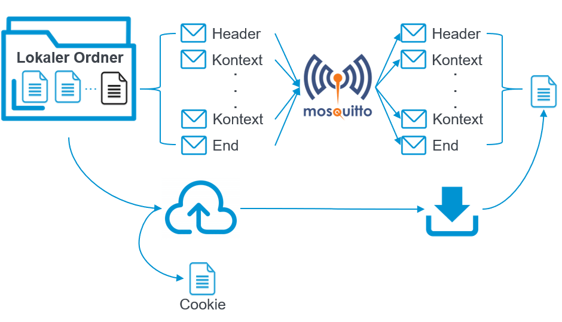
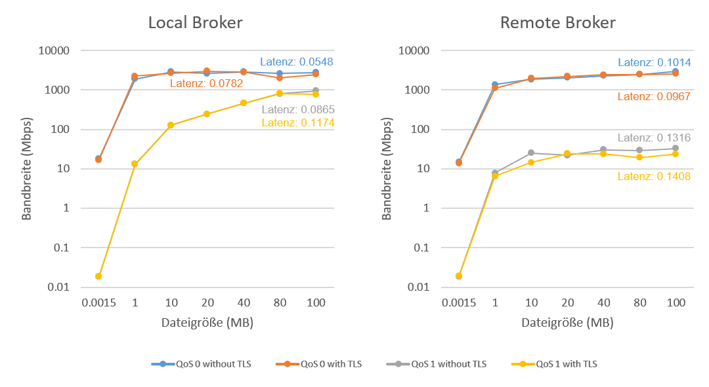

# MQTT file transfer

#### Simple scripts to transfer files using MQTT.

#### Implemented features include: resuming upload, Encrypted transmission, compressed transmission, transmission performance visualization



## Performance

- Lightweight
- TLS & Compression Transfer
- Supported File Size > 100 MB
- Latency 0.05 / 0.10 s (local broker / remote broker)
- Bandwidth 948 / 32 Mbps (QoS 1 & local broker / remote broker)



## Requirements

Install MQTT server and enable MQTT service, then run:

```bash
pip install tabulate, paho-mqtt
```

## File Transfer

### a. run download server

```
python download_server.py -p ./signal_data/sample
```

### b. run upload server

```
python download_server.py -p ./signal_data/sample
```

## Reference

[How to Send a File Using MQTT and Python](http://www.steves-internet-guide.com/send-file-mqtt/)
